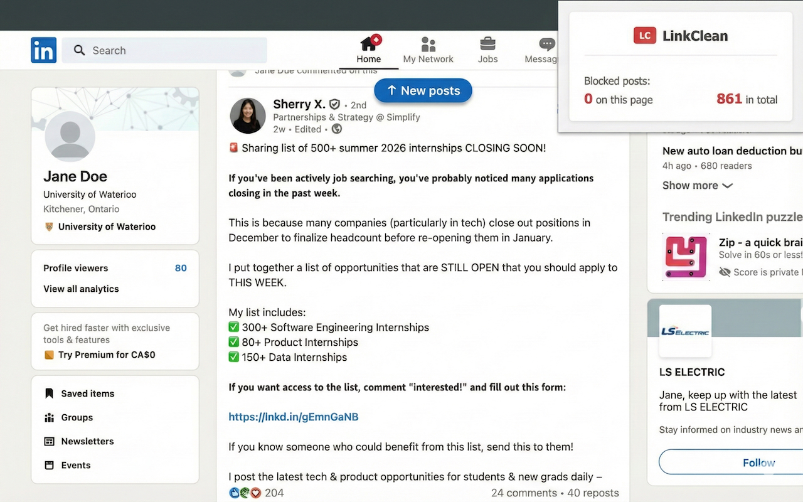

# LinkClean

**LinkClean** is a Chrome extension designed to declutter LinkedIn feeds and highlight internship-relevant posts using AI. The project combines Gemeni-powered filtering with semantic analysis to make the feed cleaner more useful for students and internship seekers.

Feel free to check out the project [here](https://chromewebstore.google.com/detail/jmbnaldbichedgpjbmfjflgincclpgkh?utm_source=item-share-cb)!

> Note: The backend uses serverless functions on Google Cloud to protect API keys and manage rate limits.

---

## Features

- **AI Filtering:** Uses semantic AI to categorize posts and filter out irrelevant content.  
- **Keyword & DOM Parsing:** Scans posts and page elements using keywords to highlight what matters most.
- **Serverless Backend:** Secure backend deployed on Google Cloud Run to handle API requests and enforce rate limits.  
- **Chrome Extension:** Lightweight, fast and easy to install, works directly in the browser without impacting performance.  

---

## 💻 Tech Stack

---

## Installation

1. Install the extension from the [Chrome Web Store](https://chromewebstore.google.com/detail/jmbnaldbichedgpjbmfjflgincclpgkh?utm_source=item-share-cb)  
2. Enable the extension in your Chrome browser  
3. Visit LinkedIn and witness your feed get filtered in real time!

---
